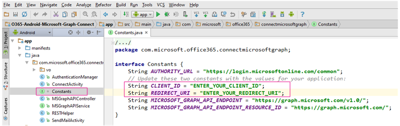

# Exemple de connexion d’Android à Office 365 avec Microsoft Graph

La connexion à Office 365 est la première étape que chaque application Android doit suivre pour commencer à travailler avec les services et les données Office 365. Cet exemple explique comment connecter, puis appeler une API via Microsoft Graph (anciennement appelé API unifiée Office 365).
> Remarque : consultez la page relative à la [prise en main des API Office 365](http://dev.office.com/getting-started/office365apis?platform=option-android#setup) pour enregistrer plus facilement votre application et exécuter plus rapidement cet exemple.

## Configuration requise de l’appareil

Pour exécuter l’exemple de connexion, votre appareil doit respecter les exigences suivantes :

* Un écran de 800 x 480, ou plus.
* Une API Android de niveau 15, ou supérieur.
 
## Conditions préalables

Pour utiliser l’exemple de connexion d’Android à Office 365, vous devez disposer des éléments suivants :

* [Android Studio](http://developer.android.com/sdk/index.html) version 1.0 ou ultérieure.
* [Kit de développement Java (JDK) 7](http://www.oracle.com/technetwork/java/javase/downloads/jdk7-downloads-1880260.html).
* Un compte Office 365. Vous pouvez vous inscrire à [Office 365 Developer](https://profile.microsoft.com/RegSysProfileCenter/wizardnp.aspx?wizid=14b845d0-938c-45af-b061-f798fbb4d170) pour accéder aux ressources dont vous avez besoin pour commencer à créer des applications Office 365.

    > Remarque : si vous avez déjà un abonnement, le lien précédent vous renvoie vers une page avec le message suivant : *Désolé, vous ne pouvez pas ajouter ceci à votre compte existant*. Dans ce cas, utilisez un compte lié à votre abonnement Office 365 existant.
* Un client Microsoft Azure pour enregistrer votre application. Azure Active Directory fournit des services d’identité que les applications utilisent à des fins d’authentification et d’autorisation. Un abonnement d’évaluation peut être demandé ici : [Microsoft Azure](https://account.windowsazure.com/SignUp).

     > Important : vous devrez également vous assurer que votre abonnement Azure est lié à votre client Office 365. Pour cela, consultez le billet du blog de l’équipe d’Active Directory relatif à la [création et la gestion de plusieurs fenêtres dans les répertoires Azure Active Directory](http://blogs.technet.com/b/ad/archive/2013/11/08/creating-and-managing-multiple-windows-azure-active-directories.aspx). La section sur l’**ajout d’un nouveau répertoire** vous explique comment procéder. Pour en savoir plus, vous pouvez également consulter la rubrique relative à la [configuration de votre environnement de développement Office 365](https://msdn.microsoft.com/office/office365/howto/setup-development-environment#bk_CreateAzureSubscription) et la section sur l’**association de votre compte Office 365 à Azure Active Directory pour créer et gérer des applications**.
      
* Un ID client et les valeurs URI de redirection d’une application enregistrée dans Azure. Cet exemple d’application doit obtenir l’autorisation **Envoyer un courrier électronique en tant qu’utilisateur** pour **Microsoft Graph**. [Ajoutez une application cliente native dans Azure](https://msdn.microsoft.com/office/office365/HowTo/add-common-consent-manually#bk_RegisterNativeApp) et [accordez-lui les autorisations appropriées](https://github.com/OfficeDev/O365-Android-Microsoft-Graph-Connect/wiki/Grant-permissions-to-the-Connect-application-in-Azure).

## Ouverture de l’exemple avec Android Studio

1. Installez [Android Studio](http://developer.android.com/sdk/index.html) et ajoutez les packages SDK Android en fonction des [instructions](http://developer.android.com/sdk/installing/adding-packages.html) données sur developer.android.com.
2. Téléchargez ou clonez cet exemple.
3. Démarrez Android Studio.
	1. Fermez tous les projets ouverts, puis cliquez sur **Ouvrir un projet Android Studio existant**.
	2. Ouvrez votre référentiel local et sélectionnez le projet O365-Android-Microsoft-Graph-Connect. Cliquez sur **OK**.
	
	> Remarque : Android Studio peut afficher une boîte de dialogue pour vous demander si vous souhaitez utiliser le wrapper Gradle. Cliquez sur **OK**.
	> 
	> **Infrastructures détectées****Référentiel de support Android**
4. Ouvrez le fichier Constants.java.
	1. Recherchez la constante CLIENT_ID et définissez sa valeur de chaîne sur l’ID du client que vous avez enregistré dans Azure Active Directory.
	2. Recherchez la constante REDIRECT_URI et définissez sa valeur de chaîne sur l’URI de redirection que vous avez enregistré dans Azure Active Directory. 
	

    > Remarque : si vous ne connaissez pas les valeurs de CLIENT_ID et de REDIRECT_URI, [ajoutez une application cliente native dans Azure](https://msdn.microsoft.com/fr-fr/library/azure/dn132599.aspx#BKMK_Adding) pour les noter.

Une fois l’exemple de connexion créé, vous pouvez l’exécuter sur un émulateur ou un appareil. Choisissez un appareil avec une API de niveau 15 ou supérieur dans la boîte de dialogue **Choisir un appareil**.

Pour en savoir plus sur cet exemple, consultez la rubrique relative à l’[appel de Microsoft Graph dans une application Android](https://graph.microsoft.io/fr-fr/docs/platform/android).

## Questions et commentaires

Nous serions ravis de connaître votre opinion sur le projet de connexion d’Android à Office 365. Vous pouvez nous faire part de vos questions et suggestions dans la rubrique [Problèmes](https://github.com/OfficeDev/O365-Android-Microsoft-Graph-Connect/issues) de ce référentiel.

Si vous avez des questions sur le développement d’Office 365, envoyez-les sur [Stack Overflow](http://stackoverflow.com/questions/tagged/Office365+API). Posez vos questions avec les tags [API] et [Office 365].

## Étapes suivantes

Cet exemple montre uniquement les conditions minimales que vos applications doivent remplir pour fonctionner avec Office 365. Vos applications peuvent faire tellement de choses grâce aux API Office 365 : aider vos utilisateurs à organiser leur semaine avec le calendrier, rechercher les informations dont ils ont besoin dans tous les fichiers stockés dans OneDrive, ou rechercher la bonne personne dans leur liste de contacts. Nous avons bien d’autres choses à vous proposer dans le [Projet de lancement des API Office 365 pour Android](https://github.com/officedev/O365-Android-Start/). Nous pensons qu’il peut vous aider à nourrir votre créativité.
  
## Ressources supplémentaires

* [Présentation de la plateforme des API Office 365](https://msdn.microsoft.com/office/office365/howto/platform-development-overview)
* [Prise en main des API Office 365](http://dev.office.com/getting-started/office365apis)
* [Présentation de Microsoft Graph d’Office 365](http://graph.microsoft.io)
* [Kit de développement logiciel (SDK) Office 365 pour Android](https://github.com/OfficeDev/Office-365-SDK-for-Android)
* [Exemples de code et projets de lancement pour les API Office 365](https://msdn.microsoft.com/office/office365/howto/starter-projects-and-code-samples)
* [Extraits de code Android Microsoft Graph Office 365](https://github.com/OfficeDev/O365-Android-Microsoft-Graph-Snippets)
* [Projet de lancement des API Office 365 pour Android](https://github.com/OfficeDev/O365-Android-Start)
* [Exemple de profil Office 365 pour Android](https://github.com/OfficeDev/O365-Android-Profile)

## Copyright
Copyright (c) 2015 Microsoft. Tous droits réservés.
